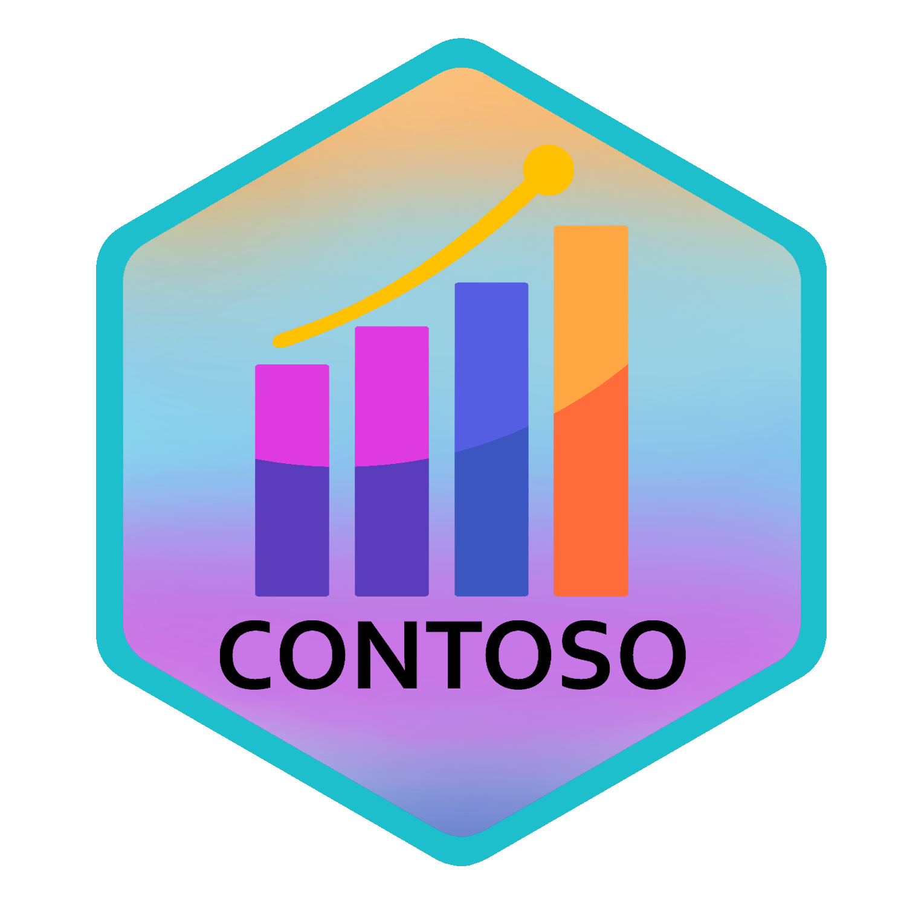
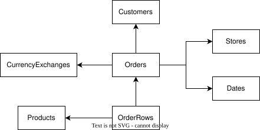

<!-- badges: start -->
<a href="https://CRAN.R-project.org/package=contoso"></a>
<!-- badges: end -->





Contoso is a synthetic dataset containing sample sales transaction data for the fictional "Contoso" company. It includes various supporting tables for business intelligence, such as customer, store, product, and currency exchange data.

This dataset is perfect for practicing time series analysis, joins, financial modeling, or any business intelligence-related tasks.

It comes with a built-in dataset as well as the ability to create an in-memory database with [duckdb](https://duckdb.org/)

The package comes with the following tables:

- **sales**:
  - Contains information about sales transactions, including the total sales amount, customer, store, and product involved.

- **customer**:
  - Contains details about customers, such as customer key, name, address, and demographic information.

- **store**:
  - Contains information about stores, including store key, name, location, and related details.

- **product**:
  - Contains information about products, such as product key, name, category, and price.

- **fx**:
  - Contains foreign exchange rate data, mapping currency pairs to their exchange rates on specific dates.

- **calendar**:
  - Contains date-related information, including date, week, month, quarter, and year for use in time-based analysis.

- **orders**:
  - Contains information about individual orders, including order key, customer key, order date, and store information.

- **orderrows**:
  - Contains detailed line items for each order, including product key, quantity, and price for each item in the order.


Built into the package is the 10K row version of the dataset.

Using `view()`, you can see the columns' label using the [labelled](https://larmarange.github.io/labelled/index.html) package.


> Inspiration to using [labelled](https://larmarange.github.io/labelled/index.html) comes from [Crystal Lewis](https://cghlewis.com/blog/dict_clean/) excellent blog post

For larger datasets, use `create_contoso_duckdb()` with one of the following sizes:

| Size   | Approx Sales Rows |
|--------|-------------------|
| small  | ~8,000            |
| medium | ~2.3 million      |
| large  | ~47 million       |
| mega   | ~237 million      |

## Data Storage

The larger datasets are stored as Parquet files on Backblaze B2 cloud storage and streamed directly into DuckDB. The bucket uses read-only public credentials:

| Setting | Value |
|---------|-------|
| Endpoint | `s3.us-east-005.backblazeb2.com` |
| Key ID | `005b2c7eeac0b520000000002` |
| Key Secret | `K005i8HhA1dzX3BNaPE2WnVevU7LBsk` |
| Bucket | `contoso-datasets` |

## Source
The data is originally sourced from the [sqlbi](https://github.com/sql-bi/Contoso-Data-Generator-V2-Data/releases/tag/ready-to-use-data) github site


### Dataset overview




The relationship keys that join each of the tables are listed below.

```{r}
#| echo: false
#| eval: true
#| label: keys
#| message: true
#| error: false
#| warning: false
#| width: 8

tibble::tibble(
    sales=c("order_key", "customer_key","store_key","product_key","currency_code")
    ,customer=c(NA,"customer_key",NA,NA,NA)
    ,product=c(NA,NA,NA,"product_key",NA)
    ,store=c(NA,NA,"store_key",NA,NA)
    ,order=c("order_key","customer_key","store_key" ,NA,NA)
    ,orderrows=c("order_key",NA,NA,"product_key",NA)
    ,fx=c(NA,NA,NA,NA,"from_currency")
) |>
    tidyr::replace_na(list(sales="",customer="",product="",store="",order="",orderrows="",fx="")) |>
    gt::gt()

```

### Installation

You can install the package from CRAN:

```{r}
#| label: install
#| eval: false

install.packages("contoso")
```

Or install the development version from [Codeberg](https://codeberg.org/usrbinr/contoso):

```{r}
#| label: codeberg
#| eval: false

# install.packages("pak")
pak::pak("codeberg::usrbinr/contoso")
```

### Example

```{r}
#| eval: false
#| label: create-contoso-duckdb

library(contoso)

# Create a DuckDB connection to Contoso datasets
db <- create_contoso_duckdb(size = "medium")

# Access the sales dataset
db$sales |> head()

# Launch the DuckDB UI to explore all tables interactively
launch_ui(db$con)

# Clean up when done
DBI::dbDisconnect(db$con, shutdown = TRUE)

```


